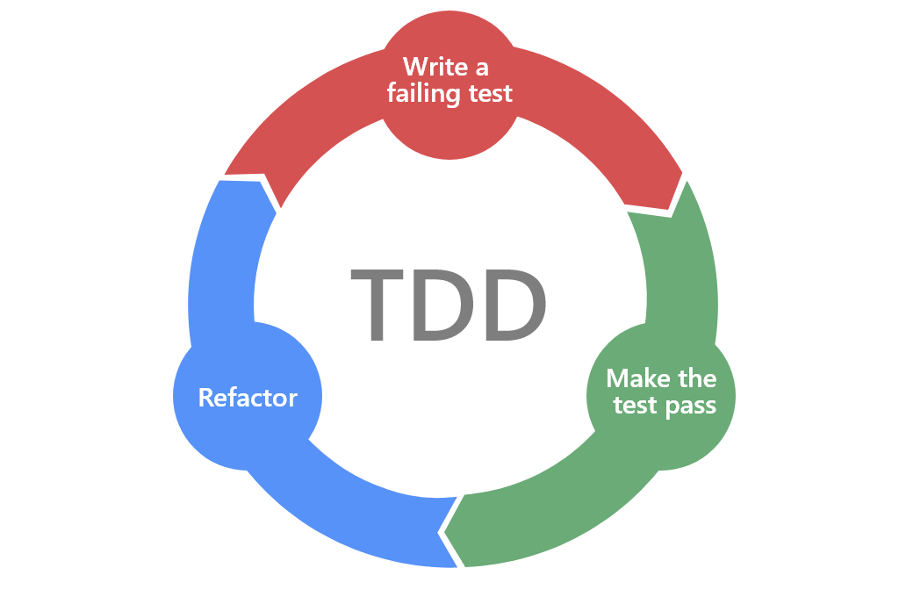

## Test Driven Development (TDD) with React Testing Library & Mock Service Worker

* Failing tests and make tests pass
* Use of Mock Service Worker
* Test Server-side errors
* Simulating user interaction
* Testing asynchronous code

#### Tech used: 
- JavaScript
- React
- React Testing Library
- Mock Service Worker, https://mswjs.io/
- VS Code
- Chrome

